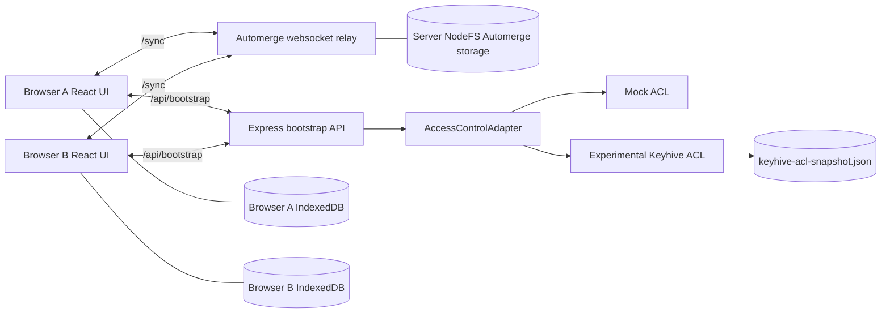

# AUTODISCO

AUTODISCO is a local-first Discord-like chat prototype built around Automerge Repo, React/Vite, and an experimental Keyhive access-control layer. It is intended as a runnable research app: you can create a workspace, open it from another browser session, exchange chat messages through Automerge sync, and exercise the current contact-card / invitation plumbing.

> Current status: useful local prototype, not production chat software. Automerge sync is real. Keyhive identity/delegation plumbing is real in the experimental profile, but browser-native Keyhive identity, production authentication, and Keyhive-enforced encrypted sync are still work in progress.

## What works today

- React + Vite web client on `http://localhost:5174`.
- Storybook component catalog on `http://localhost:6006`.
- Express + Automerge Repo relay/bootstrap server on `http://localhost:3030`.
- Real Automerge browser sync over `/sync`.
- Browser IndexedDB persistence and server NodeFS relay persistence.
- Two-browser / incognito session chat via copied Join Link.
- Mock ACL product flow by default.
- Experimental Keyhive profile with:
  - real Keyhive group/document refs;
  - real Keyhive contact-card receive;
  - real membership delegation/revocation;
  - real membership-event export/ingest;
  - durable local snapshot at `.devctl/data/autodisco-keyhive/keyhive-acl-snapshot.json`;
  - local patched Keyhive `tryEncrypt` support at adapter/test level.

## Repository layout

```text
packages/chat-core      Shared Automerge workspace schema, ids, fixtures, mutations
packages/chat-acl       Mock and experimental Keyhive access-control adapters
packages/chat-server    Express bootstrap API and Automerge websocket relay
packages/chat-web       React/Vite/Tailwind UI, Storybook, Playwright tests
packages/chat-client    Shared client package scaffold
packages/chat-bot-worker Bot-worker package scaffold
devctl/                 devctl plugin for local orchestration
ttmp/                   docmgr research/design tickets and implementation diaries
vendor/keyhive-src      Local ignored upstream Keyhive checkout with patched WASM package
```

## Prerequisites

- Node.js 22+.
- npm.
- `devctl` on PATH.
- The local patched Keyhive package at:

```text
vendor/keyhive-src/keyhive_wasm/pkg-node-patched
```

The patched Keyhive package is intentionally local/ignored because it comes from the AUTODISCO-003 source-level fix investigation. If that directory is missing, `@autodisco/chat-acl` cannot resolve its current `file:` dependency. See [AUTODISCO-003 Keyhive tryEncrypt Rust fix guide](ttmp/2026/05/09/AUTODISCO-003--keyhive-tryencrypt-wasm-binding-investigation/design/01-keyhive-tryencrypt-rust-fix-implementation-guide.md) and [AUTODISCO-003 bug report](ttmp/2026/05/09/AUTODISCO-003--keyhive-tryencrypt-wasm-binding-investigation/reports/01-keyhive-tryencrypt-bug-report.md).

Install dependencies:

```bash
npm install
```

## Running the app

### Default mock ACL profile

Use this when you want the stable chat prototype with product-shaped mock ACLs:

```bash
devctl up --profile development --force --timeout 60s
```

Open:

```text
http://localhost:5174
```

### Experimental Keyhive profile

Use this when you want the same app with the durable experimental Keyhive adapter:

```bash
devctl up --profile keyhive --force --timeout 60s
```

Open:

```text
http://localhost:5174
```

The Keyhive profile uses:

```text
ACL_MODE=keyhive-experimental
DATA_DIR=.devctl/data/autodisco-keyhive
```

The durable Keyhive snapshot is written to:

```text
.devctl/data/autodisco-keyhive/keyhive-acl-snapshot.json
```

Check services:

```bash
devctl status --tail-lines 5
```

Stop everything:

```bash
devctl down
```

## Basic chat walkthrough

1. Start the app with either profile.
2. Open `http://localhost:5174`.
3. Create a workspace.
4. Type messages in `#general`.
5. Copy the `Join Link` from the workspace card.
6. Open the Join Link in an incognito window or another browser.
7. Send messages from both sessions.

The Join Link is the user-facing sharing mechanism for the prototype. It bundles:

- the web app URL;
- the Automerge document URL;
- the websocket relay URL;
- the workspace label.

The raw `Automerge URL` and `Relay URL` fields are useful debugging controls. The Automerge URL identifies the CRDT document; the Relay URL identifies the websocket sync endpoint.

## Contact-card and invitation walkthrough

Use the `keyhive` profile for the most interesting version of this flow.

1. Start Keyhive mode:

   ```bash
   devctl up --profile keyhive --force --timeout 60s
   ```

2. Create a workspace.

3. Confirm the top-left identity card says `keyhive-experimental`.

4. Click `Copy Contact Card`.

   In Keyhive mode this copies an AUTODISCO envelope:

   ```json
   {
     "kind": "autodisco.contact-card.v1",
     "mode": "keyhive-experimental",
     "agent": { "id": "keyhive:...", "kind": "individual" },
     "keyhiveContactCardJson": "{... opaque raw Keyhive card ...}"
   }
   ```

5. Paste a peer contact-card envelope into `Peer contact card JSON`.

   For a quick self-contained test, you can paste the copied card back into the form. That exercises the code path, although a real product flow would use a different peer's card.

6. Choose access, for example `read` or `comment`.

7. Click `Create Invite`.

   The app copies an `autodisco.invitation.v1` payload and pre-fills it into the `Accept invitation JSON` form.

8. Click `Accept Invite`.

   This decodes and ingests the invitation's membership events through the active ACL adapter. In Keyhive mode, that calls real Keyhive event ingestion.

Current limitation: invitation acceptance currently ingests into the same running backend adapter. The next product step is a separate browser-native Keyhive identity or a second peer profile so one peer can invite another distinct peer.

## Useful devctl commands

```bash
# See available profiles
devctl profiles list

# Start mock mode
devctl up --profile development --force --timeout 60s

# Start experimental Keyhive mode
devctl up --profile keyhive --force --timeout 60s

# Inspect the computed launch plan
devctl plan --profile keyhive --timeout 30s

# Check running services
devctl status --tail-lines 5

# Restart only the web dev server
devctl restart web

# Create a workspace through the bootstrap API
devctl bootstrap-workspace "Devctl Test Guild"

# Run the project validation command
devctl check --timeout 300s

# Run the two-browser Automerge sync E2E test
devctl test-web-sync --timeout 120s
```

## Direct npm commands

```bash
npm run typecheck
npm test
npm run build
npm --workspace @autodisco/chat-web run build-storybook
npm --workspace @autodisco/chat-web run test:e2e
```

## HTTP API quick reference

```text
GET  /healthz
GET  /api/bootstrap/status
POST /api/bootstrap/workspaces
POST /api/bootstrap/invitations
POST /api/bootstrap/invitations/accept
POST /api/bootstrap/invitations/revoke
WS   /sync
```

Example workspace creation:

```bash
curl -s \
  -X POST http://localhost:3030/api/bootstrap/workspaces \
  -H 'content-type: application/json' \
  -d '{"name":"Intern Guild"}' | jq
```

Example runtime status:

```bash
curl -s http://localhost:3030/api/bootstrap/status | jq
```

## Key design docs

Start here:

- [AUTODISCO-001 design guide: Automerge + Keyhive Discord-like chatbot server](ttmp/2026/05/09/AUTODISCO-001--automerge-keyhive-discord-like-chatbot-server/design-doc/01-automerge-keyhive-discord-like-chatbot-server-design-guide.md)
- [AUTODISCO-002 Keyhive access-control integration design guide](ttmp/2026/05/09/AUTODISCO-002--keyhive-access-control-integration-for-autodisco/design-doc/01-keyhive-access-control-integration-design-guide.md)
- [AUTODISCO-002 tasks](ttmp/2026/05/09/AUTODISCO-002--keyhive-access-control-integration-for-autodisco/tasks.md)
- [AUTODISCO-002 investigation diary](ttmp/2026/05/09/AUTODISCO-002--keyhive-access-control-integration-for-autodisco/reference/01-investigation-diary.md)
- [AUTODISCO-002 changelog](ttmp/2026/05/09/AUTODISCO-002--keyhive-access-control-integration-for-autodisco/changelog.md)
- [AUTODISCO-003 Keyhive tryEncrypt bug report](ttmp/2026/05/09/AUTODISCO-003--keyhive-tryencrypt-wasm-binding-investigation/reports/01-keyhive-tryencrypt-bug-report.md)
- [AUTODISCO-003 Keyhive tryEncrypt Rust fix guide](ttmp/2026/05/09/AUTODISCO-003--keyhive-tryencrypt-wasm-binding-investigation/design/01-keyhive-tryencrypt-rust-fix-implementation-guide.md)

Project reports:

- [Automerge app architecture report](ttmp/2026/05/09/AUTODISCO-002--keyhive-access-control-integration-for-autodisco/project-reports/01-PROJ%20-%20AUTODISCO%20-%20Automerge%20Discord%20App%20Architecture.md)
- [Keyhive access-control architecture report](ttmp/2026/05/09/AUTODISCO-002--keyhive-access-control-integration-for-autodisco/project-reports/02-PROJ%20-%20AUTODISCO%20-%20Keyhive%20Access%20Control%20Architecture.md)

## Current architecture



## Known limitations

- This is a local development prototype, not a production deployment.
- The current Keyhive package is a local patched build, not an upstream-published fixed dependency.
- Browser-native Keyhive identities are not implemented yet.
- Invitation acceptance currently targets the running backend adapter, not a distinct browser peer.
- Automerge sync is not yet cryptographically gated by Keyhive membership.
- Keyhive access levels are mapped from AUTODISCO product levels: `comment -> edit`, `pull -> read`.
- Group object rehydration is limited by the currently exposed Keyhive WASM JS API; document-level flows are the durable path today.

## Working rule

Treat Automerge as the collaboration substrate and Keyhive as the access-control/encryption substrate. Do not treat fields inside an Automerge document as cryptographic authority. Keep mock mode honest, keep Keyhive mode opt-in, and keep adding tests whenever a feature moves from product-shaped flow to real security behavior.
