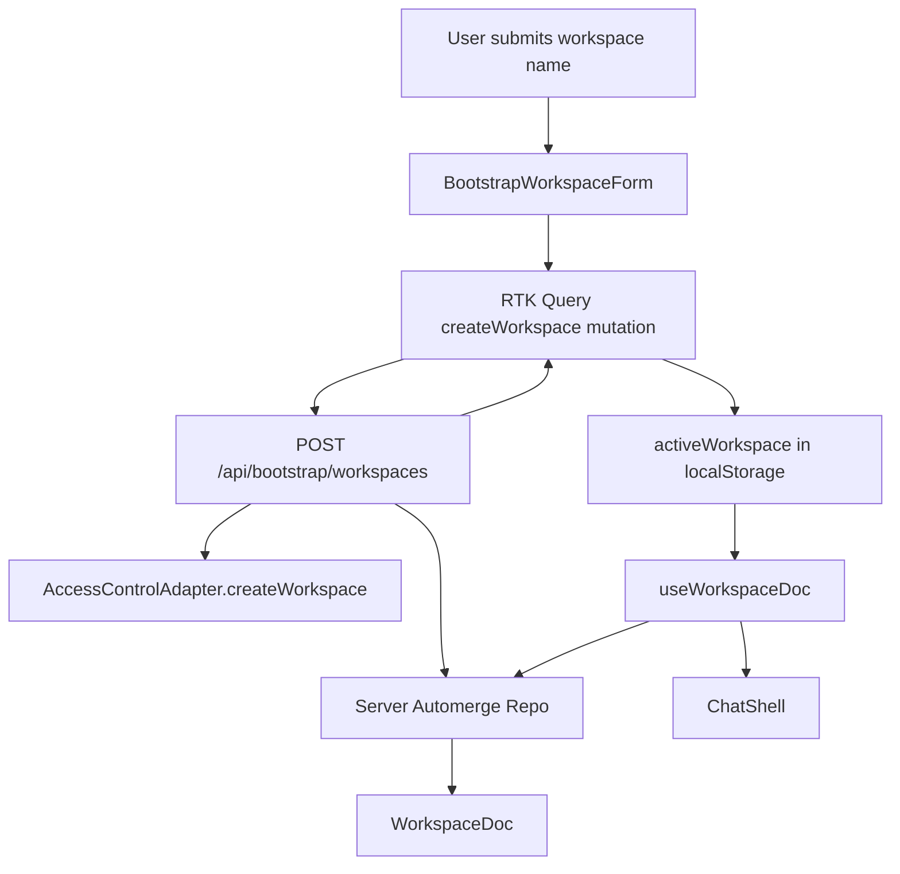
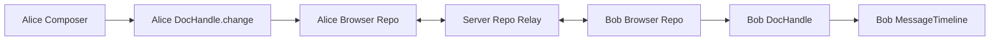
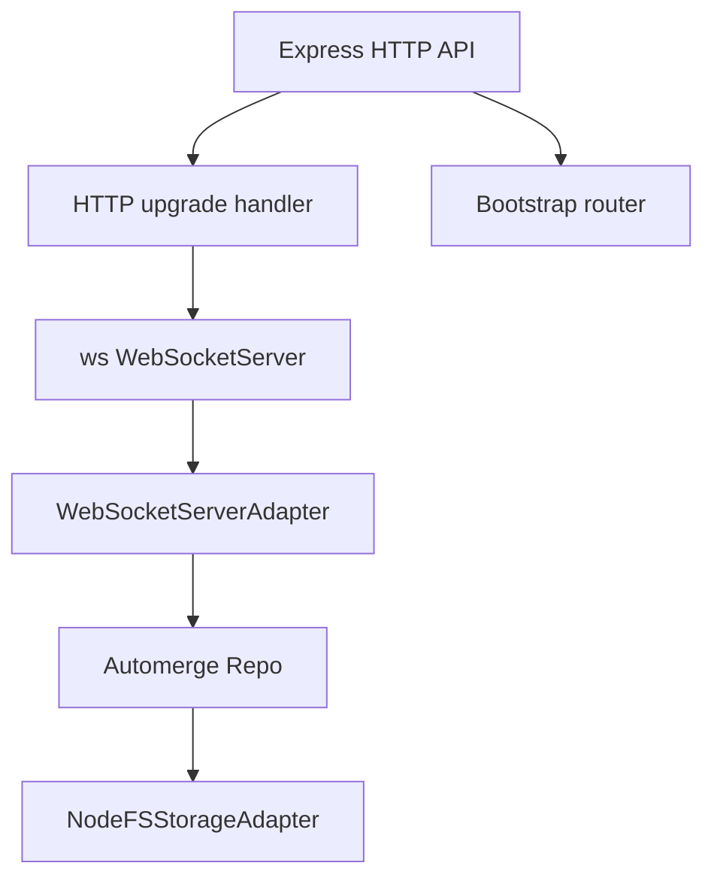

# AUTODISCO Automerge Discord App Architecture

AUTODISCO is a local-first Discord-style chat prototype built around Automerge documents rather than around a conventional server-owned database row model. The project has a TypeScript domain package, an Express and WebSocket relay, a React/Vite browser client, Storybook documentation for the component system, Playwright end-to-end tests, and devctl orchestration for running the system as a small development environment.

> [!summary]
> AUTODISCO currently proves three important ideas. First, chat state can live in Automerge documents and be mutated through `DocHandle.change` from multiple peers. Second, an Express server can bootstrap documents and then act as an Automerge Repo relay rather than as the only writer of chat state. Third, a React UI can use IndexedDB-backed Automerge Repo storage to survive reloads, reconnect after offline work, and share workspaces through document and sync URLs.

## Why this project exists

The project exists to test whether a Discord-style chatbot product can be built as a local-first collaboration system. In a conventional chat application, the server owns the canonical state. A browser sends a command such as “send message,” the server validates it, writes a database row, assigns order, and broadcasts a derived event to connected clients. That model is familiar and operationally direct, but it makes offline editing, peer-to-peer collaboration, portable state, and cryptographic document ownership difficult to add later.

AUTODISCO takes a different foundation. The durable application state is an Automerge document. A browser opens that document, applies changes locally, persists those changes locally, and synchronizes them with other peers through Automerge Repo. The server still exists, but its role is narrower. It creates initial documents, hosts a WebSocket sync endpoint, stores replicated document data on disk, and exposes bootstrap APIs. The server does not have to be the exclusive path for every application mutation.

The project is also a UI experiment. The browser app is a React, Vite, RTK Query, Tailwind, and Storybook client with a monochrome Mac OS 1 visual style. The component tree is intentionally decomposed into atoms, molecules, organisms, and pages. That structure matters because the prototype is not only a transport experiment; it is also a product surface for creating workspaces, copying join links, debugging sync state, displaying messages, and preparing for access-control work.

## Current status

The implemented system includes:

- A root npm workspace with packages for core chat state, access control, client helpers, bot worker scaffolding, server runtime, and web UI.
- A `@autodisco/chat-core` package that defines the document schema and domain mutation functions.
- A `@autodisco/chat-server` package that creates an Automerge Repo with WebSocket networking and Node filesystem persistence.
- A bootstrap HTTP API that creates workspace documents and returns `workspaceDocUrl`, `syncUrl`, and access-control metadata.
- A `@autodisco/chat-web` package that opens real Automerge documents in the browser, persists them to IndexedDB, syncs through WebSocket, and writes messages with `DocHandle.change`.
- Storybook stories for atoms, molecules, organisms, and the home page.
- Playwright and Vitest coverage for live browser sync, relay sync, offline/reconnect convergence, and relay persistence across restart.
- Devctl commands that run the server, web app, Storybook, health checks, and web sync tests.

The important status line is this: AUTODISCO is already a working local-first chat prototype. It is not only a static UI and it is not only a backend schema. Two isolated browser contexts can create/open the same workspace and exchange messages through Automerge sync.

## The foundational idea: document state, not request state

Automerge is a CRDT library. A CRDT is a data structure designed so independent replicas can accept local changes and later merge those changes without requiring a single central sequencer for every operation. In AUTODISCO, the shared application state is a JSON-shaped Automerge document. That document contains the workspace name, members, channels, messages, bot configuration, bot run records, and metadata for future access-control integration.

The main consequence is that application code does not send “message commands” to the server as the primary state transition path. Instead, application code opens a document handle and changes the document:

```ts
handle.change((doc) => {
  sendMessage(doc, {
    id: newId('msg'),
    channelId,
    authorId: identity.memberId,
    body,
    createdAt: new Date().toISOString(),
  })
})
```

The mutation is local first. The browser can apply it immediately. Automerge records the change. Automerge Repo persists and syncs it. Other peers receive the change and merge it into their local copy. The server relay does not need a custom endpoint for this specific mutation because the sync protocol transports document changes rather than application commands.

This does not remove the need for domain code. The `sendMessage` helper in `packages/chat-core/src/mutations.ts` still checks that the channel exists, refuses archived channels, initializes a message array when needed, and writes the message record with stable shape. Automerge provides merge semantics; the domain package provides application semantics.

## Package layout

The repository is organized into small packages with explicit responsibilities.

| Package | Main role | Important files |
| --- | --- | --- |
| `@autodisco/chat-core` | Shared document schema, ids, and mutation helpers. | `src/types.ts`, `src/mutations.ts`, `src/workspace.ts`, `test/workspace.test.ts` |
| `@autodisco/chat-acl` | Access-control adapter seam and experimental Keyhive work. | `src/index.ts`, `test/access.test.ts` |
| `@autodisco/chat-server` | Express API, Automerge Repo relay, WebSocket upgrade handling, filesystem persistence. | `src/app.ts`, `src/repo.ts`, `src/http/bootstrap.ts`, `test/sync.test.ts` |
| `@autodisco/chat-web` | React/Vite UI, browser Automerge Repo, IndexedDB storage, RTK Query bootstrap calls, Storybook. | `src/pages/HomePage/HomePage.tsx`, `src/features/automerge/*`, `src/components/*` |
| `@autodisco/chat-bot-worker` | Placeholder package for bot-worker direction. | `src/index.ts` |
| `@autodisco/chat-client` | Placeholder/shared client package. | `src/index.ts` |

The split is useful because both browser and server code need the same document types and mutation rules. If message validation lived only inside the React page, tests and bot workers would duplicate it. If it lived only inside the server, the local-first browser would have to round-trip through HTTP for every change. The core package gives all peers the same mutation vocabulary.

## Document schema

The central schema is `WorkspaceDoc` in `packages/chat-core/src/types.ts`:

```ts
export interface WorkspaceDoc {
  schemaVersion: 1
  workspaceId: WorkspaceId
  name: string
  createdAt: string
  categories: Record<string, CategoryRecord>
  channels: Record<string, ChannelRecord>
  members: Record<string, MemberRecord>
  roles: Record<string, RoleRecord>
  messagesByChannel: Record<string, MessageRecord[]>
  botConfigs: Record<string, BotConfig>
  botRuns: Record<string, BotRunRecord>
  keyhive?: KeyhiveRefs
}
```

The schema is deliberately one document for the prototype. A single workspace document makes the first version easy to reason about: opening a workspace gives the UI the channel list, the member list, and message arrays. This is not necessarily the final scaling shape. The type file already includes `ChannelMessagesDoc`, which points toward per-channel documents once message histories become large. The current one-document shape is an implementation stage, not a commitment that every message in every channel will remain inside one Automerge root forever.

The important fields are:

- `categories`: ordered groupings for channels.
- `channels`: text, bot-lab, and announcement channels.
- `members`: human or bot participants with roles and join time.
- `roles`: named grants for product-level permission display.
- `messagesByChannel`: message arrays keyed by channel id.
- `botConfigs`: bot identities and default channels.
- `botRuns`: structured records for bot execution state.
- `keyhive`: public access-control references reserved for Keyhive integration.

The message schema is compact but product-shaped:

```ts
export interface MessageRecord {
  id: MessageId
  authorId: MemberId | BotId
  body: string
  createdAt: string
  editedAt?: string
  replyTo?: MessageId
  reactions: Record<string, MemberId[]>
  attachments?: AttachmentRef[]
  botRunId?: BotRunId
  deletedAt?: string
}
```

This supports the first chat flow and leaves room for edits, replies, reactions, attachments, bot-generated messages, and soft deletion. Automerge can store nested maps and arrays, so this shape is natural for a prototype. The code still avoids explicit `undefined` values because Automerge rejects `undefined` fields. The helper `withoutUndefined` in `mutations.ts` removes absent optional fields before storing records.

## Domain mutations

The domain package exposes mutation functions that operate on a `WorkspaceDoc` draft. These functions are called from tests, the browser, and future server/bot code.

The core functions include:

- `addMember`
- `addRole`
- `createCategory`
- `createChannel`
- `archiveChannel`
- `sendMessage`
- `editMessage`
- `deleteMessage`
- `addReaction`
- `removeReaction`
- `createBotRun`
- `completeBotRun`
- `failBotRun`
- `listMessages`

Each mutation function is small. The design is to keep application invariants near the data shape. For example, `createChannel` verifies that the creator exists and initializes `messagesByChannel[channelId]`. `sendMessage` verifies that the channel exists, refuses archived channels, and appends a message with an empty `reactions` object. `createBotRun` computes a stable run id from channel, prompt message, and bot id, so a repeated worker pass does not create duplicate run records.

A simplified version of the message path is:

```ts
function sendMessage(doc, input) {
  const channel = requireChannel(doc, input.channelId)
  if (channel.archived) throw new ChatModelError(...)

  doc.messagesByChannel[input.channelId] ??= []
  doc.messagesByChannel[input.channelId].push({
    id: input.id,
    authorId: input.authorId,
    body: input.body,
    createdAt: input.createdAt,
    replyTo: input.replyTo,
    reactions: {},
    botRunId: input.botRunId,
  })
}
```

The functions mutate drafts rather than returning new documents because Automerge's change API gives the caller a mutable draft. That is the right boundary: core functions do domain work; `DocHandle.change` owns the Automerge transaction.

## Workspace creation

Workspace creation starts with HTTP because a new user needs a way to create the first document and learn the sync endpoint. The endpoint is `POST /api/bootstrap/workspaces`. It accepts a JSON body with a `name` field. The server then:

1. Parses and validates the workspace name.
2. Creates a workspace id with `newId('wk')`.
3. Asks the access-control adapter for workspace access metadata.
4. Creates an Automerge document with `repo.create(createWorkspaceDoc(...))`.
5. Returns the Automerge document URL and WebSocket sync URL.

The response currently has this shape:

```json
{
  "workspaceId": "wk_...",
  "workspaceDocUrl": "automerge:...",
  "syncUrl": "ws://localhost:3030/sync",
  "keyhive": {
    "workspaceGroupId": "group:Intern Guild",
    "workspaceDocumentId": "doc:Intern Guild"
  }
}
```

The Automerge document also receives matching `keyhive` metadata:

```ts
keyhive: {
  workspaceGroupId: access.workspaceGroupId,
  workspaceDocumentId: access.workspaceDocumentId,
  channelDocumentIds: {},
}
```

That metadata is not a security boundary. It is public reference data that connects the Automerge document to the access-control layer. The distinction matters because future Keyhive membership state must decide actual authorization. The Automerge field is a place for the UI and app logic to find the relevant group/document ids.

## Backend architecture

The backend is built in `packages/chat-server`. The server has two main pieces: an Express app and an Automerge Repo runtime.

`createChatServer` in `src/app.ts` constructs the Express app, installs JSON parsing, creates the repo runtime, creates or receives an ACL adapter, mounts the bootstrap router, and handles WebSocket upgrades for the sync path.

The WebSocket upgrade path is intentionally narrow:

```ts
server.on('upgrade', (request, socket, head) => {
  const pathname = new URL(request.url ?? '/', `http://${request.headers.host ?? 'localhost'}`).pathname
  if (pathname !== config.syncPath) {
    socket.destroy()
    return
  }
  runtime.wss.handleUpgrade(request, socket, head, (ws) => {
    runtime.wss.emit('connection', ws, request)
  })
})
```

Only requests to `config.syncPath`, currently `/sync`, are handed to the Automerge WebSocket server adapter. Other upgrade requests are rejected. This keeps the HTTP API and sync transport separate even though they share one TCP listener.

The repo runtime in `src/repo.ts` is concise:

```ts
const repo = new Repo({
  network: [new WebSocketServerAdapter(wss as never, 60_000)],
  storage: new NodeFSStorageAdapter(config.dataDir),
  peerId: `chat-relay-${os.hostname()}` as PeerId,
  sharePolicy: async () => false,
})
```

The runtime has three responsibilities:

- It accepts WebSocket sync connections.
- It persists document data under `config.dataDir` through `NodeFSStorageAdapter`.
- It acts as a repo peer with a stable server peer id.

The `sharePolicy: async () => false` setting deserves careful reading. It means the relay should not proactively announce all documents to other peers. It does not by itself implement authorization for peers who already know a document URL. AUTODISCO currently relies on explicit document URL sharing and application-level ACL work. A future secure relay must authenticate peers and enforce document access before sync.

## Browser Automerge runtime

The browser runtime is in `packages/chat-web/src/features/automerge/repo.ts`. It creates one Automerge Repo per sync URL and stores those repos in a module-level map:

```ts
const repos = new Map<string, Repo>()
```

That map matters because a React page can re-render many times. Creating a new Repo for every render would create duplicate WebSocket connections and duplicate IndexedDB state managers. The helper `getBrowserRepo(syncUrl)` returns the existing repo when possible.

The browser repo uses three pieces:

```ts
new Repo({
  network: [new WebSocketClientAdapter(syncUrl, 1_000)],
  storage: new IndexedDBStorageAdapter(storageDatabaseName(syncUrl)),
  peerId: getSessionPeerId(),
})
```

The WebSocket client adapter connects to the server's `/sync` endpoint. The IndexedDB adapter persists Automerge data across reloads. The peer id is stored in `sessionStorage`, not `localStorage`, so a browser tab/session has a stable peer id for the current session without permanently binding all future sessions to the same peer id.

The reset function shuts down the repo and deletes the IndexedDB database for the sync URL:

```ts
await repo.shutdown()
indexedDB.deleteDatabase(storageDatabaseName(syncUrl))
```

The UI exposes this through “Reset Local.” That is important for a local-first prototype because bugs often become persistent through local storage. A reset button gives the developer a deterministic way to clear browser-side CRDT and identity state.

## React document hooks

The browser opens documents through `useWorkspaceDoc`. The hook accepts a `workspaceDocUrl` and `syncUrl`, asks the browser repo to find the document, subscribes to handle change events, and publishes React state whenever the document changes.

The lifecycle is:

1. If there is no document URL, state is `idle`.
2. When a URL appears, state becomes `loading`.
3. The browser repo calls `find<WorkspaceDoc>(workspaceDocUrl)`.
4. The returned handle is subscribed with `handle.on('change', publish)`.
5. `publish` reads `handle.doc()` and stores it in React state.
6. Cleanup removes the change listener if the component unmounts or the URL changes.

The hook does not own domain mutation semantics. It only opens and observes the document. Mutations are supplied by `useWorkspaceActions`, which returns a `send` function that wraps `sendMessage` in a `handle.change` call.

The second hook, `useEnsureWorkspaceReady`, is a prototype convenience. When a browser opens an empty workspace, the hook ensures that the local identity exists as a member and that there is at least one `general` channel. This is useful for the first prototype because it removes a separate onboarding step. It should be revisited when real access control is enabled, because auto-adding a local member is not valid security behavior.

## The web page as application coordinator

`HomePage.tsx` coordinates four separate concerns:

- HTTP bootstrap calls through RTK Query.
- Automerge document open/sync state through custom hooks.
- Local identity and contact-card state.
- Product UI state such as logs, join links, active workspace, and reset behavior.

The page starts by loading local identity and active workspace state:

```ts
const identity = useMemo(() => getLocalIdentity(), [])
const [activeWorkspace, setActiveWorkspace] = useState(() => loadActiveWorkspace())
```

The active workspace is not the document itself. It is the information needed to open the document:

```ts
interface ActiveWorkspace {
  workspaceDocUrl: string
  syncUrl: string
  label: string
  keyhive?: {
    workspaceGroupId: string
    workspaceDocumentId: string
  }
}
```

This distinction is important. `activeWorkspace` is local browser metadata; `workspaceState.doc` is the replicated Automerge document. The page can know what it is trying to open before the document is ready.

The create flow is:

1. User submits `BootstrapWorkspaceForm`.
2. Page calls `createWorkspace({ name }).unwrap()`.
3. Server returns doc and sync URLs.
4. Page saves `activeWorkspace` to `localStorage`.
5. `useWorkspaceDoc` reacts to the new active workspace and opens the Automerge doc.
6. `useEnsureWorkspaceReady` adds the local member and default channel if needed.
7. `ChatShell` renders the workspace.

The open flow is similar but starts with pasted document/sync URLs. The join-link flow encodes those URLs in query parameters:

```ts
url.searchParams.set('doc', workspace.workspaceDocUrl)
url.searchParams.set('sync', workspace.syncUrl)
url.searchParams.set('label', workspace.label)
```

A second browser can open the same workspace by receiving that URL or by receiving the saved `activeWorkspace` JSON in tests.

## Component system

The web UI is organized by component scale:

- **Atoms**: `MacButton`, `MacPanel`, `MacTextField`, `StatusPill`.
- **Molecules**: `BootstrapWorkspaceForm`, `Composer`, `IdentityCard`, `InvitationForm`, `MessageBubble`, `OpenWorkspaceForm`, `WorkspaceCard`.
- **Organisms**: `ChannelSidebar`, `ChatShell`, `LogPane`, `MessageTimeline`.
- **Page**: `HomePage`.

The important implementation choice is that styling uses a part contract. Components expose `data-widget="autodisco"` and `data-part="..."` attributes. CSS in `src/index.css` applies the Mac OS 1 monochrome visual system to parts instead of relying only on component-local class names. This makes the component system themable and Storybook-friendly.

For example, the workspace card exposes parts for the card, header, actions, and data list. The same CSS pattern is reused for the identity card. The page itself uses `data-part="app-page"`, `hero-panel`, and `work-area` to define the two-column layout.

The UI intentionally does not include a menu bar or window chrome. The visual language is monochrome panels, inset borders, compact controls, dotted background texture, and status pills. The design supports the prototype goal: it gives developers a clear view of document URLs, sync status, local identity, invitation data, and logs without adding ornamental application chrome.

## RTK Query in the architecture

RTK Query is used for bootstrap and invitation HTTP APIs. It is not used for live chat messages. This separation is correct for the architecture.

The HTTP API is appropriate for operations that are not themselves Automerge document edits:

- create workspace;
- create invitation;
- revoke invitation;
- eventually accept invitation or exchange contact-card data.

Live messages are Automerge mutations. Sending a message through RTK Query would create a second state path and make the local-first design harder to reason about. The current split says: use RTK Query to obtain or exchange access/bootstrap metadata; use Automerge Repo for collaborative document state.

## Storybook and MSW

Storybook is built with `@storybook/react-vite`. The story structure follows the component hierarchy, so each component has its own folder and story file. MSW is installed and configured through `msw-storybook-addon`, and the generated service worker lives under `packages/chat-web/public/mockServiceWorker.js`.

Storybook serves two purposes in this project. First, it documents the visual component system independently of the live Automerge runtime. Second, it catches component/API drift through `build-storybook`. The validation command has been part of the project acceptance loop:

```bash
npm --workspace @autodisco/chat-web run build-storybook
```

That matters because local-first systems can be hard to test only through the full app. Storybook keeps the UI building even when backend or sync experiments change.

## Sync and persistence tests

AUTODISCO has layered tests that prove the Automerge side works at multiple levels.

### Node multi-peer sync

`packages/chat-server/test/sync.test.ts` creates a real server with a temporary data directory, bootstraps a workspace, then creates two independent Node Automerge repos connected to the server WebSocket sync URL. Alice initializes the workspace; Bob waits until he sees the channel and members. Alice and Bob then write messages concurrently, and the test waits until both handles contain both messages.

The structure is:

```ts
const aliceRepo = createClientRepo('alice', started.syncUrl)
const bobRepo = createClientRepo('bob', started.syncUrl)

const aliceHandle = await aliceRepo.find<WorkspaceDoc>(bootstrap.workspaceDocUrl)
const bobHandle = await bobRepo.find<WorkspaceDoc>(bootstrap.workspaceDocUrl)

sendChatMessage(aliceHandle, ...)
sendChatMessage(bobHandle, ...)

await waitForMessages(aliceHandle, channelId, expectedBodies)
await waitForMessages(bobHandle, channelId, expectedBodies)
```

This test proves that the relay can connect independent repos and that Automerge can merge concurrent message appends.

### Offline reconnect

The offline test gives Bob a filesystem-backed client repo, syncs once, shuts Bob down, lets Alice write while Bob is away, creates a local-only Bob repo that writes offline, shuts it down, then reconnects Bob with the original data directory. The final assertion is that both Alice and Bob see both messages.

This test matters because offline work is not a cosmetic feature in local-first design. The system must be able to store local changes, reconnect later, and converge.

### Relay persistence across restart

The persistence test creates a workspace, writes a message, waits until the server repo has the message, flushes the repo, stops the server without deleting its data directory, starts a new server using the same directory, and verifies that the restarted server and a new client can read the message.

This test proves that the relay is not only a transient message broker. It stores replicated document data on disk through `NodeFSStorageAdapter`.

### Browser E2E sync

`packages/chat-web/e2e/live-sync.spec.ts` runs in Playwright with two isolated browser contexts. Alice creates a workspace through the UI. The test copies Alice's saved `autodisco.activeWorkspace` metadata into Bob's localStorage, reloads Bob, waits for sync, sends a message from Alice, verifies Bob sees it, sends a message from Bob, and verifies Alice sees it.

This is the highest-level proof because it includes:

- the Vite app;
- the browser Automerge Repo;
- IndexedDB storage;
- WebSocket sync;
- React rendering;
- the server health endpoint;
- actual UI controls.

## Dev workflow

The project uses root npm scripts and devctl orchestration.

Important npm scripts:

```bash
npm run typecheck
npm test
npm run build
npm run test:e2e:web
npm --workspace @autodisco/chat-web run build-storybook
```

Important devctl commands:

```bash
devctl up --force --timeout 60s
devctl status --tail-lines 3
devctl bootstrap-workspace "Devctl Test Guild"
devctl check --timeout 300s
devctl test-web-sync --timeout 120s
devctl down
```

The web app runs on port `5174` with Vite `--strictPort` because another application uses `5173`. Storybook runs on `6006`. The chat server runs on `3030`. Vite proxies `/api` to the server and proxies `/sync` as a WebSocket endpoint.

## Data flow diagrams

### Workspace creation and open



### Message send and sync



### Server runtime boundary



## Failure modes already encountered

Several implementation failures shaped the current design.

The browser build originally failed on Automerge WASM loading:

```text
[UNLOADABLE_DEPENDENCY] Could not load .../automerge_wasm_bg.wasm
```

The fix was to add `vite-plugin-wasm`. This is a structural dependency now: any browser build that imports Automerge Repo must be able to bundle/load WASM correctly.

TypeScript originally failed because Storybook files were outside the web package `rootDir`:

```text
TS6059: File 'packages/chat-web/.storybook/main.ts' is not under 'rootDir' 'packages/chat-web/src'.
```

The fix was to exclude `.storybook` from the app `tsconfig` and validate Storybook through its own build.

The web port originally drifted because Vite tried to fall back from `5173` when that port was busy. The project now uses explicit `5174` and `--strictPort`. This matters because join links and tests depend on stable origins.

Automerge rejected explicit `undefined` when adding optional Keyhive metadata:

```text
RangeError: Cannot assign undefined value at /keyhive
```

The fix was to omit optional properties entirely when they are absent. This is a general Automerge rule for this codebase: do not store explicit `undefined` in document values.

## What to understand before modifying the app

The core implementation rule is that there are two separate state paths.

The first path is HTTP bootstrap state. It creates or exchanges metadata required to open a workspace. RTK Query owns this path. It is request/response oriented.

The second path is collaborative document state. It is opened through Automerge Repo and changed through `DocHandle.change`. React observes it through handle change events. This path is local-first and syncs through WebSocket.

A new developer should not add an HTTP endpoint called `/messages/send` unless the intent is to deliberately change the architecture. The correct place to add message behavior is usually `packages/chat-core/src/mutations.ts`, then call it from a handle change on the client or bot worker.

## Near-term technical direction

The Automerge side has a strong prototype foundation. The next architectural steps are:

1. Move large message histories into per-channel documents when message volume requires it.
2. Decide how channel document URLs are created, stored, and opened by the UI.
3. Add bot worker behavior that watches channels through Automerge Repo and writes bot run records through the same mutation path as users.
4. Tighten the relationship between local identity, workspace membership, and access-control state.
5. Replace mock local member auto-add behavior when real invitation acceptance exists.
6. Add authenticated sync admission once Keyhive or Beelay integration is ready.

## Working rule

Treat Automerge as the state and synchronization substrate, not as an authorization system. Treat the Express server as a bootstrap and relay process, not as the sole owner of chat state. Treat React as a document observer and local mutation initiator, not as a cache of server responses. If a change should be collaborative and offline-capable, it belongs in an Automerge document mutation. If a change establishes access, identity, or invitation metadata, it belongs behind the access-control adapter and may be surfaced through HTTP.
