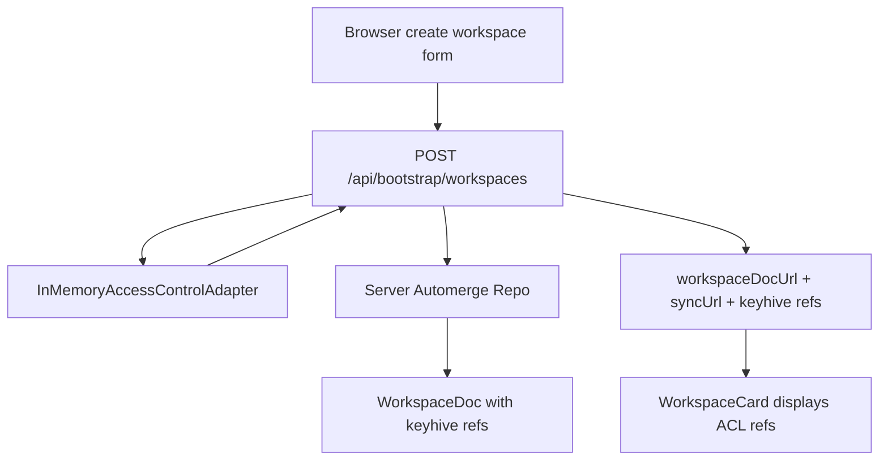
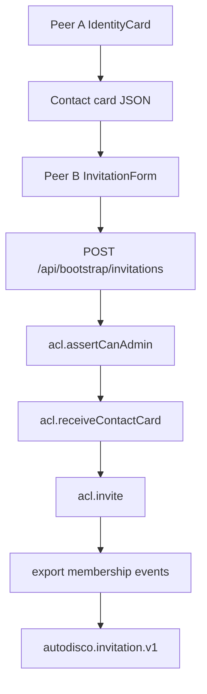
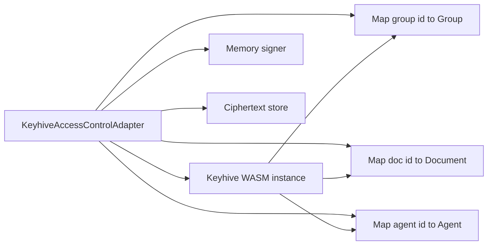

# AUTODISCO Keyhive Access Control Architecture

AUTODISCO's Keyhive work adds an access-control layer to an already working Automerge chat prototype. The Automerge system can create workspace documents, replicate them through a WebSocket relay, persist them on the server, persist them in the browser, and merge concurrent or offline edits. That solves collaboration. It does not solve authorization. Keyhive is the intended direction for identity, invitation, delegation, revocation, membership-event synchronization, and eventually encrypted document access.

> [!summary]
> The Keyhive implementation is intentionally staged. The stable default is a mock access-control product flow that gives the app identity cards, contact cards, invitations, workspace ACL metadata, admin checks, and permission-denied feedback. The experimental path uses real `@keyhive/keyhive` WASM for identities, groups, documents, delegation, revocation, archive export, and membership events. Content encryption is not yet proven because `tryEncrypt` currently fails in the Node spike with a low-level WASM `null pointer passed to rust` error.

## Why this project needs Keyhive

A Discord-style chat system has many authorization questions. Who can read a workspace? Who can comment in a channel? Who can invite a new member? Who can revoke a bot? Who can retrieve encrypted bytes from a relay? Who can decrypt those bytes after retrieval? Who can continue reading a document after being removed? These questions cannot be answered safely by a mutable `members` map inside a shared Automerge document.

The reason is direct. Automerge is the collaboration substrate. It stores and merges application state. If a user can write to the document, that user can also propose changes to ordinary document fields. A field such as `members[mem_alice].roles = ['admin']` is useful product state, but it is not a cryptographic proof that Alice should have admin capability. The authorization layer must live outside ordinary document fields and must be enforced at the boundaries where peers learn document ids, retrieve document bytes, decrypt content, and submit semantically meaningful changes.

Keyhive addresses that layer. It models individuals, groups, documents, delegations, revocations, contact cards, membership events, signing keys, ciphertext storage, and encrypted content operations. In AUTODISCO, Keyhive is not replacing Automerge. The two systems answer different questions:

| Layer | Question answered | AUTODISCO implementation |
| --- | --- | --- |
| Automerge | What is the shared workspace state, and how do concurrent edits merge? | `WorkspaceDoc`, `DocHandle.change`, WebSocket sync, IndexedDB, NodeFS storage. |
| Keyhive | Which identities have which capabilities over which groups/documents? | `AccessControlAdapter`, mock adapter, experimental `KeyhiveAccessControlAdapter`. |
| Product UI | How does a user create, join, invite, reset, inspect, and debug a workspace? | React components, RTK Query bootstrap/invite endpoints, debug log pane. |

The current implementation keeps these layers separate. That is the central design rule.

## Current status

The Keyhive side has five completed implementation stages.

First, workspace bootstrap now calls the access-control adapter and stores public access-control references in `WorkspaceDoc.keyhive`. The bootstrap response includes `keyhive.workspaceGroupId` and `keyhive.workspaceDocumentId`, and the web UI displays/copies those values.

Second, the browser has a mock identity and contact-card flow. Each browser gets a persisted mock member id, display name, mock public key, and fingerprint. The `IdentityCard` component displays this data and can copy a product-shaped contact-card JSON document.

Third, the server has mock invitation and revocation endpoints. The user can paste a contact-card JSON blob into `InvitationForm`, select an access level, create an invitation, and copy the returned invitation JSON. The server checks admin permission before creating or revoking invitations.

Fourth, the mock app has visible permission-denied behavior. Sending a message checks a mock comment permission helper before writing the Automerge mutation. Invite and revoke operations call `assertCanAdmin` server-side.

Fifth, the project has an experimental real Keyhive adapter. It is selected with `ACL_MODE=keyhive-experimental`. It can create real Keyhive groups and documents, receive real Keyhive contact cards, add members, revoke members, export membership events, ingest event bytes, and export archive bytes. It does not yet provide durable identity reload or proven content encryption.

## Access-control vocabulary

The shared access package defines these access levels:

```ts
export type ChatAccess = 'pull' | 'read' | 'comment' | 'edit' | 'admin'
```

These names are product-level access concepts:

- `pull` means the peer may retrieve document bytes but not necessarily decrypt or understand them.
- `read` means the peer may read the content.
- `comment` means the peer may add chat messages or reactions without full edit authority.
- `edit` means the peer may perform broader document edits.
- `admin` means the peer may invite, revoke, and administer access.

The real Keyhive WASM API currently recognizes at least `read`, `edit`, and `admin`. The spike showed that `Access.tryFromString('read')` returns `Read`, `edit` returns `Edit`, and `admin` returns `Admin`, while `pull` and `comment` returned `undefined`. The experimental adapter therefore maps AUTODISCO access to Keyhive access as follows:

```ts
admin -> admin
edit -> edit
comment -> edit
read -> read
pull -> read
```

This mapping is conservative for the prototype but not final. `comment -> edit` is broader than the product semantics. `pull -> read` is broader than a ciphertext-only permission. The report records this because the mapping must be revisited before any security claim.

## The access-control adapter seam

The important interface is `AccessControlAdapter` in `packages/chat-acl/src/index.ts`:

```ts
export interface AccessControlAdapter {
  localMemberId(): string
  localPublicKey(): Uint8Array
  createWorkspace(name: string): Promise<WorkspaceAccessBundle>
  createChannel(workspace: WorkspaceAccessBundle, channelId: string, visibility: 'workspace' | 'private'): Promise<ChannelAccessBundle>
  receiveContactCard(cardJson: unknown): Promise<AgentRef>
  invite(agent: AgentRef, target: MemberedRef, access: ChatAccess): Promise<void>
  revoke(agent: AgentRef, target: MemberedRef): Promise<void>
  assertCanRead(docOrChannel: string): Promise<void>
  assertCanComment(channelId: string): Promise<void>
  assertCanAdmin(target: string): Promise<void>
  exportMembershipEventsFor(agent: AgentRef): Promise<Uint8Array[]>
  ingestMembershipEvents(events: Uint8Array[]): Promise<Uint8Array[]>
}
```

This interface is the boundary between product code and access-control implementation. The server does not need to know whether it is using the in-memory mock adapter or the experimental Keyhive adapter. It asks for workspace metadata, receives contact cards, invites agents, revokes agents, and checks admin permission through the same methods.

This is the right shape for the project because the access-control technology is unstable. Keyhive is pre-alpha. The app can still build its product flow against a stable local interface while the real Keyhive implementation matures behind that interface.

## Mock adapter

The mock adapter is `InMemoryAccessControlAdapter`. It has a local member id, a local public key, and a map of grants:

```ts
readonly #grants = new Map<string, Set<ChatAccess>>()
```

When a workspace is created, the mock adapter returns deterministic product-shaped ids:

```ts
{
  workspaceGroupId: `group:${name}`,
  workspaceDocumentId: `doc:${name}`,
}
```

It grants `admin` on the workspace document id to the local adapter. When channels are created, it creates `doc:channel:${channelId}` and grants admin on both the channel id and channel document id.

The mock `receiveContactCard` accepts two shapes. It understands the app's mock nested contact card:

```json
{
  "kind": "autodisco.contact-card.v1",
  "mode": "mock",
  "agent": {
    "id": "mem_peer",
    "kind": "individual"
  },
  "publicKey": "..."
}
```

It also falls back to a legacy top-level `id` field or a generated timestamp id. This lenience is useful for early UI work. It should not be carried into a hardened protocol without explicit validation.

The mock adapter's role is not to provide security. Its role is to force the app to behave as if access control exists. That means the UI must display identity, copy contact cards, paste contact cards, create invitations, handle denied operations, and keep access-control metadata separate from ordinary workspace fields.

## Workspace bootstrap with ACL metadata

The first implemented Keyhive task was to wire ACL metadata into workspace bootstrap.

The endpoint `POST /api/bootstrap/workspaces` now does this:

```ts
const access = await acl.createWorkspace(name)
const handle = repo.create(
  createWorkspaceDoc({
    workspaceId,
    name,
    createdAt: new Date().toISOString(),
    keyhive: {
      workspaceGroupId: access.workspaceGroupId,
      workspaceDocumentId: access.workspaceDocumentId,
      channelDocumentIds: {},
    },
  }),
)
```

The response includes:

```ts
res.status(201).json({
  workspaceId,
  workspaceDocUrl: handle.url,
  syncUrl: syncUrl(config),
  keyhive: access,
})
```

The important detail is that the same ids are present in two places:

1. The HTTP response, so the creating browser can immediately display/copy them.
2. The Automerge document, so every peer that opens the workspace can see the public access-control references.

This does not authorize peers. It creates the reference data that invitation and access-control code can use.

## Browser identity and contact cards

The browser identity code lives in `packages/chat-web/src/features/automerge/identity.ts`. It creates or loads:

- `autodisco.memberId`
- `autodisco.displayName`
- `autodisco.publicKey`

The current public key is mock data: 32 random bytes encoded as base64. The fingerprint is a compact display string derived from the base64 key. The identity shape is:

```ts
export interface LocalIdentity {
  memberId: MemberId
  displayName: string
  publicKey: string
  publicKeyFingerprint: string
}
```

The mock contact card is:

```ts
export interface AutodiscoContactCardV1 {
  kind: 'autodisco.contact-card.v1'
  mode: 'mock'
  displayName: string
  agent: {
    id: string
    kind: 'individual'
  }
  publicKey: string
  createdAt: string
}
```

The `IdentityCard` component displays the local display name, member id, key fingerprint, and mode. Its copy button serializes the contact card and writes it to the clipboard. This gives the user an explicit product action: “copy my contact card.”

That action is a placeholder for the real Keyhive operation:

```ts
const card = await keyhive.contactCard()
const json = card.toJson()
```

The UI does not need to know the final internal representation. It needs a stable action and a stable place to display local identity.

## Invitation creation and revocation

The invitation endpoint is `POST /api/bootstrap/invitations`. It accepts:

```ts
{
  workspaceDocumentId: string
  contactCard: unknown
  access: 'pull' | 'read' | 'comment' | 'edit' | 'admin'
}
```

The server flow is:

1. Parse and validate the request.
2. Check `acl.assertCanAdmin(workspaceDocumentId)`.
3. Call `acl.receiveContactCard(contactCard)`.
4. Build a target `{ id: workspaceDocumentId, kind: 'document' }`.
5. Call `acl.invite(agent, target, access)`.
6. Export membership events for the agent.
7. Return a product-shaped invitation JSON payload.

The response includes `membershipEvents` encoded as base64 strings:

```ts
invitation: {
  kind: 'autodisco.invitation.v1',
  mode: 'mock',
  agent,
  target,
  access: invite.access,
  membershipEvents: membershipEvents.map((event) => Buffer.from(event).toString('base64')),
}
```

In mock mode, `membershipEvents` is empty because the in-memory adapter does not produce real events. In experimental Keyhive mode, the adapter can call `eventsForAgent` and return serialized event bytes. Encoding those bytes as base64 is the right transport shape because invitation JSON must be safe to copy, paste, and send over HTTP.

Revocation is handled by `POST /api/bootstrap/invitations/revoke`. It validates the workspace document id and agent, checks admin permission, then calls `acl.revoke(agent, target)`. This endpoint is currently a low-level product flow rather than a full member management UI, but it proves the server-side revoke seam exists.

Invitation acceptance is not complete. `/api/bootstrap/invitations/accept` intentionally returns HTTP 501. That is the correct state until the project decides how invitation payloads, membership event ingestion, Automerge document URLs, and local identity setup should interact.

## Web invitation UI

`InvitationForm` is a molecule component. It lets the user choose an access level and paste peer contact-card JSON. It is disabled until the active workspace has a `workspaceDocumentId`. The page handler parses JSON, calls the RTK Query mutation, copies the returned invitation JSON, and logs the result.

The important product sequence is:

```text
Peer A copies contact card
Peer B pastes contact card
Peer B selects access
Peer B creates invitation
Peer B copies invitation JSON
Peer A eventually accepts invitation
```

Only the first four and the copy step are implemented. Acceptance is the next major missing piece.

## Mock application enforcement

The app now has a mock permission check before browser message sends:

```ts
const decision = canCommentInMockWorkspace(workspaceState.doc, identity.memberId, channelId)
if (!decision.allowed) {
  appendLog('error', 'Permission denied: cannot comment', decision.reason)
  return
}
```

The helper checks three facts:

- the workspace document is ready;
- the local member exists in the workspace document;
- the channel exists.

This is not security. It is a product guardrail. It shows where comment permission should be checked before writing a local Automerge mutation. The server invite/revoke operations are stronger in the current prototype because they call the adapter's `assertCanAdmin` method before changing grants.

The limitation is important. `useEnsureWorkspaceReady` currently auto-adds the local identity to the workspace. That is good for a collaboration demo and wrong for a final authorization model. Once invitation acceptance exists, auto-add should be removed or restricted to bootstrap-created local workspaces.

## Real Keyhive WASM spike

The project installed `@keyhive/keyhive@next`, which resolved to `0.0.0-alpha.56c`. The previous guess `@localfirst/keyhive` was not published. The package includes Node, bundler, and slim WASM outputs.

The stable spike script lives at:

```text
ttmp/2026/05/09/AUTODISCO-002--keyhive-access-control-integration-for-autodisco/scripts/02-keyhive-node-spike-stable.mjs
```

It proves this sequence:

```js
const a = await Keyhive.init(Signer.generateMemory(), CiphertextStore.newInMemory(), eventHandler)
const b = await Keyhive.init(Signer.generateMemory(), CiphertextStore.newInMemory(), () => {})

const card = await b.contactCard()
const individual = await a.receiveContactCard(ContactCard.fromJson(card.toJson()))

const group = await a.generateGroup([])
const doc = await a.generateDocument([group.toPeer()], new ChangeId(new Uint8Array(32)), [])

const access = Access.tryFromString('read')
const delegation = await a.addMember(individual.toAgent(), doc.toMembered(), access, [])
const revocations = await a.revokeMember(individual.toAgent(), true, doc.toMembered())
```

A successful run returns JSON with two Keyhive identity ids, a group id, a document id, a verified delegation, at least one revocation, event count, and stats. The same working subset is now covered by `packages/chat-acl/test/keyhive-spike.test.ts`.

The spike proves that real Keyhive is usable for the access-control operations AUTODISCO needs first: identity, contact-card exchange, group/document creation, add member, revoke member, event generation, and archive serialization.

## The tryEncrypt issue

Content encryption is not proven. The focused reproduction script lives at:

```text
ttmp/2026/05/09/AUTODISCO-002--keyhive-access-control-integration-for-autodisco/scripts/03-keyhive-encrypt-spike.mjs
```

The failing call is structurally:

```js
const enc = await kh.tryEncrypt(
  doc,
  new ChangeId(new Uint8Array([4, 5, 6])),
  [cid],
  new TextEncoder().encode('hello')
)
```

The runtime error is:

```text
Error: null pointer passed to rust
    at __wbg___wbindgen_throw_81fc77679af83bc6
    ...
    at ChangeId.__wasm_refgen_toJsChangeId
```

This is not a normal application-level failure. It is a low-level WASM/Rust binding failure around `ChangeId` conversion. The TypeScript declaration says:

```ts
tryEncrypt(
  doc: Document,
  content_ref: ChangeId,
  js_pred_refs: ChangeId[],
  content: Uint8Array
): Promise<EncryptedContentWithUpdate>
```

The copied Rust binding shows a subtle difference:

```rust
pub async fn try_encrypt(
    &self,
    doc: JsDocument,
    content_ref: JsChangeId,
    js_pred_refs: Vec<JsChangeIdRef>,
    content: &[u8],
)
```

The `Vec<JsChangeIdRef>` detail is suspicious. The generated TypeScript presents predecessor refs as `ChangeId[]`, but the Rust binding expects reference-shaped values. The failure may be caused by an undocumented invariant, an ownership/reference issue, an invalid content-ref history, or an upstream binding bug. Until this is resolved, AUTODISCO must not claim end-to-end encrypted content support.

The right next debugging step is to produce a minimal upstream-ready repro that tests `tryEncrypt` with:

- the same `ChangeId` passed to `generateDocument`;
- a fresh content ref with no predecessors;
- a fresh content ref with the initial content ref as predecessor;
- browser/bundler target instead of Node target;
- `tryEncryptArchive` versus `tryEncrypt`.

If the minimal call still fails with a null pointer, it should be reported upstream with package version, Node version, script, and stack trace.

## Experimental Keyhive adapter

`KeyhiveAccessControlAdapter` is now implemented behind the same interface as the mock adapter. It is selected by:

```ts
createAccessControlAdapter({ mode: 'keyhive-experimental' })
```

The server config exposes:

```ts
aclMode: env.ACL_MODE === 'keyhive-experimental' ? 'keyhive-experimental' : 'mock'
```

That means the stable default remains mock mode. A developer can opt in with:

```bash
ACL_MODE=keyhive-experimental npm --workspace @autodisco/chat-server run dev
```

The adapter stores real WASM wrapper objects because later Keyhive calls need object methods such as `toMembered()` and `toAgent()`:

```ts
readonly #documents = new Map<string, KeyhiveWasm.Document>()
readonly #groups = new Map<string, KeyhiveWasm.Group>()
readonly #agents = new Map<string, KeyhiveWasm.Agent>()
```

Workspace creation creates a real Keyhive group and document:

```ts
const group = await keyhive.generateGroup([])
const doc = await keyhive.generateDocument([group.toPeer()], randomChangeId(), [])
const workspaceGroupId = group.groupId.toString()
const workspaceDocumentId = doc.doc_id.toString()
```

Contact-card receive parses either a raw string or an object with `keyhiveContactCardJson`, then calls:

```ts
const individual = await keyhive.receiveContactCard(KeyhiveWasm.ContactCard.fromJson(json))
```

Invite and revoke call real Keyhive membership operations:

```ts
await keyhive.addMember(wasmAgent, membered, keyhiveAccess, [])
await keyhive.revokeMember(wasmAgent, true, membered)
```

The adapter can export archive bytes:

```ts
return (await (await this.keyhive()).toArchive()).toBytes()
```

It can also export its own contact card JSON for tests and future UI:

```ts
return (await (await this.keyhive()).contactCard()).toJson()
```

The experimental adapter tests prove workspace refs, local member id, public key, archive bytes, contact-card exchange, delegation, membership event export, revocation, and denied admin checks for unknown targets.

## Persistence limitation

The adapter can export a Keyhive archive, but durable reload is not complete. A safe reload path needs both Keyhive archive bytes and signing-key recovery. The current type declarations show `Signer.memorySignerFromBytes(bytes: Uint8Array)`, but the inspected API did not expose an obvious private-key export method. The adapter currently creates a memory signer at construction time:

```ts
readonly #signer = KeyhiveWasm.Signer.generateMemory()
```

That signer is not durable across process restart. Therefore, `ACL_MODE=keyhive-experimental` is suitable for tests and short-lived development spikes, not persistent production use.

A future persistence design must answer:

1. How do we export or derive durable signer material?
2. Where is that signer material stored?
3. How is it encrypted at rest?
4. How do we pair signer material with Keyhive archive bytes?
5. How does the server recover documents, groups, and known agents into the adapter's maps after restart?

Until those questions are answered, the real adapter is intentionally limited.

## Data flow diagrams

### Mock workspace bootstrap



### Contact-card invitation flow



### Experimental adapter object graph



## Testing strategy

The Keyhive work has tests at three levels.

First, `packages/chat-acl/test/access.test.ts` tests the mock adapter. It verifies that creating a workspace grants admin on the workspace document, missing comment grants are denied, nested contact cards parse correctly, and invite/revoke calls run.

Second, `packages/chat-server/test/bootstrap.test.ts` tests the server product flow. It verifies that workspace bootstrap returns ACL metadata and stores matching metadata in the Automerge document. It then creates a mock invitation, verifies the returned agent/target/access fields, checks that an unknown document id returns 403, and revokes the invite.

Third, `packages/chat-acl/test/keyhive-spike.test.ts` and `keyhive-adapter.test.ts` test the real Keyhive working subset. These tests are valuable because they lock in exactly what the experimental dependency currently supports.

The validation loop is:

```bash
npm run typecheck
npm test
npm run build
npm --workspace @autodisco/chat-web run build-storybook
devctl test-web-sync --timeout 120s
docmgr doctor --ticket AUTODISCO-002 --stale-after 30
```

The browser sync test remains important even for Keyhive work because access-control changes must not break the working Automerge collaboration path.

## Current risks

The main risks are technical and semantic.

The first risk is overclaiming. Mock ACL metadata and mock contact cards are not real security. The UI should continue to show `mode: mock` where appropriate. The experimental adapter should continue to be opt-in.

The second risk is access-level mismatch. AUTODISCO wants `pull` and `comment`, but the observed Keyhive API recognizes `read`, `edit`, and `admin`. The current mapping is good enough for a spike and not good enough for a final product.

The third risk is persistence. A Keyhive identity that cannot be restored after restart is not a durable identity. Archive export alone is not enough.

The fourth risk is encryption. The `tryEncrypt` failure blocks any claim that document content can be encrypted and decrypted through the current integration.

The fifth risk is relay authorization. Automerge Repo sync still allows peers that know the document URL and sync URL to participate in the development flow. A secure relay needs authenticated peer metadata and Keyhive-aware access checks, or a Beelay-style transport.

## What should happen next

The next implementation steps should be ordered by dependency.

First, build invitation acceptance in mock mode. The app should be able to paste an `autodisco.invitation.v1` payload, ingest membership events when present, store active workspace metadata, and open the workspace. Even if the membership events are empty in mock mode, the product path must exist.

Second, add an opt-in devctl command for `ACL_MODE=keyhive-experimental`. This command should create a workspace, create a second adapter/contact card, invite it, revoke it, and report ids/events. That gives developers a repeatable smoke test without manually editing environment variables.

Third, solve Keyhive persistence. Identify how signer material should be exported/imported or how a durable signer should be configured. Pair that with archive byte storage and reload tests.

Fourth, isolate `tryEncrypt` in an upstream-ready repro. If the failure is caused by usage, document the correct invariant. If the failure is in the generated bindings or Rust side, open an upstream issue.

Fifth, design authenticated sync. Do not try to force real security into the current URL-sharing relay. Decide whether Automerge Repo access hooks are enough for the next phase or whether Beelay must become the sync transport for protected content.

## Working rule

Keep real access control behind `AccessControlAdapter`. Keep Automerge document fields as application state and public references, not as cryptographic authority. Keep mock mode honest by naming it mock. Keep experimental Keyhive mode opt-in until identity persistence, access-level mapping, encryption, and relay authorization are resolved. When a feature crosses from product-shaped mock flow to real security flow, add a test that proves the relevant Keyhive operation, not only a UI assertion.
