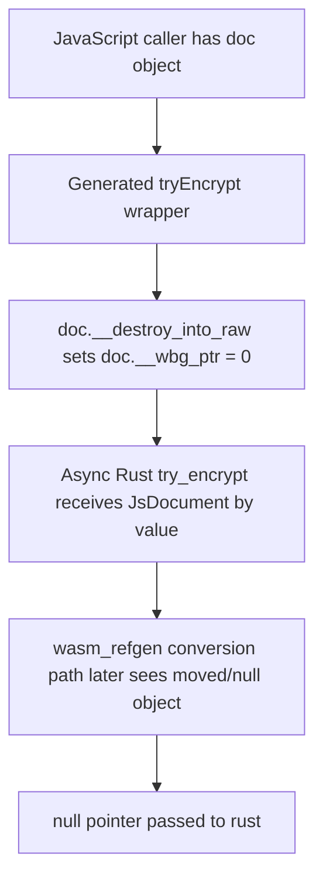
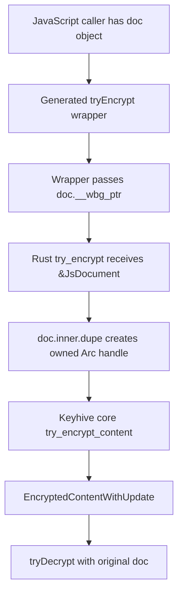

# Keyhive `tryEncrypt` Rust Fix Implementation Guide

This guide explains the Keyhive `tryEncrypt` failure, the relevant Rust and generated JavaScript binding layers, the experiments that isolated the problem, and the minimal Rust patch that compiles and verifies locally. It is written for a new intern who needs to understand the system before touching the code. The goal is not only to say which line to change. The goal is to make the ownership boundary between Rust, `wasm-bindgen`, `wasm_refgen`, and JavaScript concrete enough that the intern can reason about the failure and defend the patch upstream.

> [!summary]
> The bug is in the JavaScript-facing WASM binding shape for `Keyhive.tryEncrypt`. The published API accepts a `Document`, but the generated wrapper consumes the document pointer with `doc.__destroy_into_raw()`. The async Rust implementation later needs document/ref conversion during the encryption path and fails with `null pointer passed to rust`. Borrowing the document in the Rust binding, duplicating the inner `Arc`, and passing the borrowed content ref makes the generated JS wrapper stop consuming the arguments. The patched source compiles with Rust 1.90, builds a Node WASM package with `wasm-pack`, and passes a local encryption/decryption repro that fails against the published package.

## Current conclusion

The minimal source change is:

```diff
 #[wasm_bindgen(js_name = tryEncrypt)]
 pub async fn try_encrypt(
     &self,
-    doc: JsDocument,
-    content_ref: JsChangeId,
+    doc: &JsDocument,
+    content_ref: &JsChangeId,
     js_pred_refs: Vec<JsChangeIdRef>,
     content: &[u8],
 ) -> Result<JsEncryptedContentWithUpdate, JsEncryptError> {
@@
     Ok(self
         .0
-        .try_encrypt_content(doc.inner, &content_ref, &pred_refs, content)
+        .try_encrypt_content(doc.inner.dupe(), content_ref, &pred_refs, content)
         .await?
         .into())
 }
```

The patch is stored at:

```text
patches/01-tryencrypt-borrow-document.patch
```

It compiles:

```bash
cargo +1.90.0 check -p keyhive_wasm
```

It builds a Node WASM package:

```bash
RUSTUP_TOOLCHAIN=1.90.0 npx --yes wasm-pack build --out-dir pkg-node-patched --target nodejs --dev
```

It verifies with a local patched Node repro:

```bash
node scripts/09-keyhive-tryencrypt-patched-local-repro.mjs
```

The patched repro exits `0` and prints:

```text
hello
```

## Why the bug matters

AUTODISCO uses Automerge for local-first document collaboration and Keyhive for the future access-control and encryption layer. The Keyhive access-control work already proves identity creation, contact-card exchange, group creation, document creation, member delegation, member revocation, membership event export, and archive export. The missing piece was content encryption. The published `tryEncrypt` API failed before encryption could be used safely in the prototype.

The failure is important because it blocks a specific question: can a JavaScript application use Keyhive's WASM bindings to encrypt and decrypt document content with a real Keyhive document? If `tryEncrypt` fails at the binding layer, the AUTODISCO project cannot proceed to end-to-end encrypted Automerge payloads without either a workaround or an upstream fix.

The discovered workaround proves the core encryption path works. Passing `doc.__wasm_refgen_toJsDocument()` to `tryEncrypt` succeeds. `tryEncryptArchive(doc, ...)` also succeeds. That means the issue is not that Keyhive cannot encrypt. The issue is the public JavaScript-facing ownership shape of one binding.

## The relevant system layers

There are four layers involved.

1. **Keyhive core** owns the real document encryption logic. It is Rust code in `keyhive_core`. It works with `Document`, CGKA state, content refs, predecessor refs, signer state, random number generation, and encrypted content records.
2. **Keyhive WASM wrappers** expose core types to JavaScript. These wrappers live in `keyhive_wasm/src/js`. They define `JsKeyhive`, `JsDocument`, `JsChangeId`, `JsEncrypted`, and other JS-visible classes.
3. **wasm-bindgen and wasm_refgen** generate JavaScript glue. The glue decides whether JS wrapper objects are borrowed by pointer, moved with `__destroy_into_raw()`, or converted from JS references with generated upcast/ref methods.
4. **Application JavaScript** imports `@keyhive/keyhive`, calls `Keyhive.init`, creates documents, and calls `tryEncrypt`/`tryDecrypt`.

The bug crosses layers two and three. The Rust binding type tells `wasm-bindgen` how to generate JavaScript glue. Taking `doc: JsDocument` by value causes generated JS to consume the JavaScript object. Taking `doc: &JsDocument` causes generated JS to borrow the pointer without consuming the JavaScript object.

## File map

The intern should start with these files.

| File | Why it matters |
| --- | --- |
| `/home/manuel/code/wesen/2026-05-09--automerge-discord/vendor/keyhive-src/keyhive_wasm/src/js/keyhive.rs` | Defines `JsKeyhive`, including `generateDocument`, `tryEncrypt`, `tryEncryptArchive`, and `tryDecrypt`. This is the patch site. |
| `/home/manuel/code/wesen/2026-05-09--automerge-discord/vendor/keyhive-src/keyhive_wasm/src/js/document.rs` | Defines `JsDocument`, its `inner: Arc<Mutex<Document<...>>>`, and the `Dupe` implementation that lets the binding duplicate the underlying document handle safely. |
| `/home/manuel/code/wesen/2026-05-09--automerge-discord/vendor/keyhive-src/keyhive_wasm/src/js/change_id.rs` | Defines `JsChangeId` and `JsChangeIdRef`, showing how `wasm_refgen` generates ref/upcast handling. |
| `/home/manuel/code/wesen/2026-05-09--automerge-discord/vendor/keyhive-src/keyhive_core/src/keyhive.rs` | Defines `Keyhive::try_encrypt_content`, the core-facing API called by the WASM wrapper. |
| `/home/manuel/code/wesen/2026-05-09--automerge-discord/vendor/keyhive-src/keyhive_core/src/principal/document.rs` | Defines `Document::try_encrypt_content`, where CGKA app secrets and encrypted content are produced. |
| `node_modules/@keyhive/keyhive/pkg-node/keyhive_wasm.js` | Published generated JS glue. This is where the failing wrapper consumes `doc` with `__destroy_into_raw()`. |
| `/home/manuel/code/wesen/2026-05-09--automerge-discord/vendor/keyhive-src/keyhive_wasm/pkg-node-patched/keyhive_wasm.js` | Locally rebuilt patched JS glue. This is where the fixed wrapper borrows `doc.__wbg_ptr`. |

## What `JsDocument` is

`JsDocument` is the WASM-facing wrapper around a Keyhive document:

```rust
#[wasm_bindgen(js_name = Document)]
#[derive(Debug, Clone, Dupe)]
pub struct JsDocument {
    pub(crate) doc_id: DocumentId,
    pub(crate) inner: Arc<Mutex<Document<Local, JsSigner, JsChangeId, JsEventHandler>>>,
}
```

The important field is `inner`. It is an `Arc<Mutex<...>>`, so a `JsDocument` is not the full document value itself. It is a shareable handle to a document protected by a mutex. The `Dupe` derive means the code can cheaply duplicate the `Arc` handle. Duplicating the handle is different from cloning all document data. It creates another reference to the same shared document state.

This is why the patch uses:

```rust
.try_encrypt_content(doc.inner.dupe(), content_ref, &pred_refs, content)
```

That call gives Keyhive core the owned `Arc<Mutex<Document<...>>>` it needs without consuming or invalidating the JavaScript wrapper object.

`JsDocument` also exposes conversions used by other parts of Keyhive:

```rust
pub fn to_peer(&self) -> JsPeer
pub fn to_agent(&self) -> JsAgent
pub fn to_membered(&self) -> JsMembered
```

Those methods also call `self.inner.dupe()`. This establishes the local idiom: when the binding needs an owned principal handle but the JS object should remain usable, duplicate the inner `Arc`.

## What `JsChangeId` and `JsChangeIdRef` are

`JsChangeId` is a byte-vector wrapper:

```rust
#[wasm_bindgen(js_name = ChangeId)]
#[derive(Debug, Clone, PartialEq, Eq, PartialOrd, Ord, Hash, Serialize, Deserialize, Into, From)]
pub struct JsChangeId(pub(crate) Vec<u8>);
```

It also has:

```rust
#[wasm_refgen(js_ref = JsChangeIdRef)]
#[wasm_bindgen(js_class = ChangeId)]
impl JsChangeId { ... }
```

The `wasm_refgen` attribute creates a JavaScript reference/upcast path. In Rust, a function can accept `Vec<JsChangeIdRef>` and convert each ref back into a `JsChangeId`:

```rust
let pred_refs: Vec<JsChangeId> = js_pred_refs
    .into_iter()
    .map(|js_ref| JsChangeId::from_js_ref(&js_ref))
    .collect();
```

This matters because JavaScript arrays of predecessor refs pass through a different path than by-value function arguments. The matrix experiments showed that predecessor refs are not the primary cause of the direct `tryEncrypt` failure. Fresh predecessor refs work. Reusing a `ChangeId` object that has already been consumed by another generated wrapper does fail, which is expected when generated JS has called `__destroy_into_raw()` on that object.

The rule for interns is simple: if a generated wrapper consumes an object with `__destroy_into_raw()`, do not reuse the same JavaScript object later. If the same bytes are needed again, construct a new `ChangeId` from the bytes.

## The failing published binding

The published generated Node wrapper for `tryEncrypt` looks like this:

```js
tryEncrypt(doc, content_ref, js_pred_refs, content) {
    _assertClass(doc, Document);
    var ptr0 = doc.__destroy_into_raw();
    _assertClass(content_ref, ChangeId);
    var ptr1 = content_ref.__destroy_into_raw();
    const ptr2 = passArrayJsValueToWasm0(js_pred_refs, wasm.__wbindgen_malloc);
    const len2 = WASM_VECTOR_LEN;
    const ptr3 = passArray8ToWasm0(content, wasm.__wbindgen_malloc);
    const len3 = WASM_VECTOR_LEN;
    const ret = wasm.keyhive_tryEncrypt(this.__wbg_ptr, ptr0, ptr1, ptr2, len2, ptr3, len3);
    return ret;
}
```

`__destroy_into_raw()` does three things:

1. It takes the raw WASM pointer out of the JS wrapper object.
2. It sets the wrapper object's `__wbg_ptr` to `0`.
3. It unregisters the object from finalization.

After that call, the JavaScript object has been moved. If anything later tries to treat that same JS object as a valid reference, the pointer is null.

The error observed from Node is:

```text
Error: null pointer passed to rust
```

The stack includes wasm-bindgen closure machinery and the generated callback used for ref conversion:

```text
at wasm_bindgen__convert__closures_____invoke__...
at real (.../keyhive_wasm.js:3404:20)
```

The error is low-level. It is not a domain error such as “missing app secret,” “invalid document,” or “unknown content ref.” That is one reason the binding shape was the right place to investigate.

## The passing archive binding

The published generated wrapper for `tryEncryptArchive` differs:

```js
tryEncryptArchive(doc, content_ref, pred_refs, content) {
    _assertClass(doc, Document);
    _assertClass(content_ref, ChangeId);
    const ptr0 = passArrayJsValueToWasm0(pred_refs, wasm.__wbindgen_malloc);
    const len0 = WASM_VECTOR_LEN;
    const ptr1 = passArray8ToWasm0(content, wasm.__wbindgen_malloc);
    const len1 = WASM_VECTOR_LEN;
    const ret = wasm.keyhive_tryEncryptArchive(this.__wbg_ptr, doc.__wbg_ptr, content_ref.__wbg_ptr, ptr0, len0, ptr1, len1);
    return ret;
}
```

This wrapper borrows `doc.__wbg_ptr` and `content_ref.__wbg_ptr`. It does not call `__destroy_into_raw()` for either argument. The Rust source explains why:

```rust
pub async fn try_encrypt_archive(
    &self,
    doc: &JsDocument,
    content_ref: &JsChangeId,
    pred_refs: Vec<JsChangeIdRef>,
    content: &[u8],
) -> Result<JsEncryptedContentWithUpdate, JsEncryptError> {
    ...
    self.0.try_encrypt_content(doc.inner.dupe(), content_ref, &pred_refs, content)
}
```

This passing function gave the shape of the fix.

## Why borrowing fixes the wrapper

`wasm-bindgen` uses Rust argument types to decide generated JS ownership behavior.

When Rust takes a class wrapper by value:

```rust
doc: JsDocument
```

then generated JS moves that object into Rust:

```js
var ptr0 = doc.__destroy_into_raw()
```

When Rust takes a class wrapper by reference:

```rust
doc: &JsDocument
```

then generated JS passes the existing pointer:

```js
doc.__wbg_ptr
```

The patch changes `try_encrypt` to match `try_encrypt_archive`:

```rust
pub async fn try_encrypt(
    &self,
    doc: &JsDocument,
    content_ref: &JsChangeId,
    js_pred_refs: Vec<JsChangeIdRef>,
    content: &[u8],
) -> Result<JsEncryptedContentWithUpdate, JsEncryptError>
```

Because the core Keyhive function still needs an owned `Arc<Mutex<Document<...>>>`, the patch duplicates the inner document handle:

```rust
doc.inner.dupe()
```

This is the same pattern used by `try_encrypt_archive`, `try_decrypt`, `to_peer`, `to_agent`, and `to_membered`.

## Pseudocode for the fixed call path

The fixed call path is:

```text
JavaScript caller
  -> kh.tryEncrypt(doc, contentRef, predRefs, bytes)
  -> generated JS validates doc is Document
  -> generated JS passes doc.__wbg_ptr, not doc.__destroy_into_raw()
  -> Rust receives &JsDocument
  -> Rust duplicates doc.inner Arc
  -> Rust converts predecessor refs from JsChangeIdRef to JsChangeId
  -> Rust calls Keyhive core try_encrypt_content
  -> core locks document and creates encrypted content
  -> Rust returns JsEncryptedContentWithUpdate
  -> JavaScript decrypts with kh.tryDecrypt(doc, encrypted)
```

In pseudocode:

```rust
fn try_encrypt(self, doc_ref, content_ref, pred_refs, content) {
    let pred_refs = pred_refs.map(from_js_ref)
    let doc_handle = duplicate_arc(doc_ref.inner)
    let encrypted = keyhive_core.try_encrypt_content(
        doc_handle,
        content_ref,
        pred_refs,
        content,
    )
    return encrypted.into_js()
}
```

The key property is that the JavaScript `doc` object remains valid after the call. The caller can still use it for `tryDecrypt`, `forcePcsUpdate`, subsequent encryption calls, or membership inspection.

## Experiment results

The experiments are stored in `scripts/` and `artifacts/` under this ticket.

### Minimal failing npm repro

Script:

```text
scripts/07-keyhive-tryencrypt-minimal-repro.mjs
```

Result:

```text
artifacts/07-keyhive-tryencrypt-minimal-repro.exitcode.txt = 1
artifacts/07-keyhive-tryencrypt-minimal-repro.stderr.log contains "null pointer passed to rust"
```

This script imports the published package:

```js
import * as KH from '@keyhive/keyhive'
```

and calls:

```js
await kh.tryEncrypt(doc, cid([13, 14, 15]), [cid([10, 11, 12])], bytes)
```

It fails.

### Minimal workaround against npm package

Script:

```text
scripts/08-keyhive-tryencrypt-workaround-repro.mjs
```

Result:

```text
artifacts/08-keyhive-tryencrypt-workaround-repro.exitcode.txt = 0
artifacts/08-keyhive-tryencrypt-workaround-repro.stdout.log = hello
```

The only important difference is:

```js
await kh.tryEncrypt(doc.__wasm_refgen_toJsDocument(), ...)
```

This proves that the encryption/decryption core can work from JavaScript when the document argument is passed in a ref/upcast form rather than the original direct wrapper object.

### Matrix experiment

Script:

```text
scripts/03-keyhive-tryencrypt-matrix-runner.mjs
```

Result:

```json
{
  "total": 48,
  "pass": 16,
  "fail": 32,
  "byStage": {
    "uncaughtException": 32,
    "complete": 16
  }
}
```

The matrix varied:

- `tryEncrypt` vs `tryEncryptArchive`;
- `expandPrekeys` false/true;
- group-backed vs no-group document;
- 3-byte vs 32-byte initial content refs;
- no predecessor refs, fresh predecessor refs, and reused initial object predecessor refs.

All direct `tryEncrypt(doc, ...)` cases failed. `tryEncryptArchive(doc, ...)` passed when predecessor refs were fresh or absent. Reusing a consumed `ChangeId` object failed, which is expected from generated wrapper ownership behavior.

### Reference/upcast variant experiment

Script:

```text
scripts/04-keyhive-tryencrypt-ref-variants.mjs
```

Result:

```json
{
  "total": 9,
  "pass": 7,
  "fail": 2
}
```

The decisive cases were:

```text
FAIL tryEncrypt-direct-doc-direct-content-empty-preds
PASS tryEncrypt-ref-doc-direct-content-empty-preds
FAIL tryEncrypt-direct-doc-ref-content-empty-preds
PASS tryEncrypt-ref-doc-ref-content-empty-preds
```

Changing the content ref to a ref/upcast value does not fix the failure. Changing the document argument does. This isolates the document binding as the problem.

### Rust unit test translation

Script:

```text
scripts/06-keyhive-rust-unit-js-translation-runner.mjs
```

Result:

```json
{
  "total": 3,
  "pass": 2,
  "fail": 1
}
```

The source Rust test calls `try_encrypt(doc.clone(), ...)`. The closest JavaScript equivalent is `doc.__wasm_refgen_toJsDocument()`, not the direct `doc` object. With that change, the JS translation passes two encryption/decryption rounds.

### Patched local package verification

After applying the Rust patch and rebuilding `keyhive_wasm` locally, the direct JavaScript call passes.

Script:

```text
scripts/09-keyhive-tryencrypt-patched-local-repro.mjs
```

Result:

```text
artifacts/15-keyhive-tryencrypt-patched-local-repro.exitcode.txt = 0
artifacts/15-keyhive-tryencrypt-patched-local-repro.stdout.log = hello
```

The script imports the locally built patched package:

```js
const pkg = resolve(here, '../../../../../../vendor/keyhive-src/keyhive_wasm/pkg-node-patched/keyhive_wasm.js')
const KH = await import(pkg)
```

and then calls the direct public shape:

```js
await kh.tryEncrypt(doc, cid([13, 14, 15]), [cid([10, 11, 12])], bytes)
```

That is the verification that the Rust patch fixes the original JS API shape.

## Compile and build verification

The first `cargo check` failed because the machine's default Rust toolchain was 1.88 and the Keyhive workspace requires Rust 1.90:

```text
error: rustc 1.88.0 is not supported by the following packages:
  keyhive_wasm@0.3.0 requires rustc 1.90.0
  keyhive_core@0.3.0 requires rustc 1.90.0
  wasm_refgen@0.1.5 requires rustc 1.90.0
```

This failure is captured in:

```text
artifacts/11-cargo-check-keyhive-wasm.stderr.log
```

I installed the required toolchain:

```bash
rustup toolchain install 1.90.0
```

Then the patched source compiled:

```bash
cd /home/manuel/code/wesen/2026-05-09--automerge-discord/vendor/keyhive-src
cargo +1.90.0 check -p keyhive_wasm
```

Captured result:

```text
artifacts/12-cargo-check-keyhive-wasm-rust190.exitcode.txt = 0
```

Then the patched Node WASM package built:

```bash
cd /home/manuel/code/wesen/2026-05-09--automerge-discord/vendor/keyhive-src/keyhive_wasm
RUSTUP_TOOLCHAIN=1.90.0 npx --yes wasm-pack build --out-dir pkg-node-patched --target nodejs --dev
```

Captured result:

```text
artifacts/13-wasm-pack-build-node-patched.exitcode.txt = 0
```

The patched generated wrapper no longer calls `__destroy_into_raw()` for `doc` or `content_ref`:

```js
tryEncrypt(doc, content_ref, js_pred_refs, content) {
    _assertClass(doc, Document);
    if (doc.__wbg_ptr === 0) {
        throw new Error('Attempt to use a moved value');
    }
    _assertClass(content_ref, ChangeId);
    if (content_ref.__wbg_ptr === 0) {
        throw new Error('Attempt to use a moved value');
    }
    const ptr0 = passArrayJsValueToWasm0(js_pred_refs, wasm.__wbindgen_malloc);
    const len0 = WASM_VECTOR_LEN;
    const ptr1 = passArray8ToWasm0(content, wasm.__wbindgen_malloc);
    const len1 = WASM_VECTOR_LEN;
    const ret = wasm.keyhive_tryEncrypt(this.__wbg_ptr, doc.__wbg_ptr, content_ref.__wbg_ptr, ptr0, len0, ptr1, len1);
    return ret;
}
```

Captured snippet:

```text
artifacts/14-patched-generated-js-tryencrypt-snippet.txt
```

## Implementation sequence for an intern

Follow this sequence when preparing a clean upstream branch.

### Step 1: Create a clean branch

```bash
cd /home/manuel/code/wesen/2026-05-09--automerge-discord/vendor/keyhive-src
git checkout -b fix-js-tryencrypt-borrow-document
```

Use a clone outside AUTODISCO for upstream PR work if you plan to push. The clone inside the ticket is for investigation and reproducibility.

### Step 2: Edit `keyhive_wasm/src/js/keyhive.rs`

Change only `try_encrypt` first. Keep the patch minimal.

Before:

```rust
pub async fn try_encrypt(
    &self,
    doc: JsDocument,
    content_ref: JsChangeId,
    js_pred_refs: Vec<JsChangeIdRef>,
    content: &[u8],
) -> Result<JsEncryptedContentWithUpdate, JsEncryptError> {
    ...
    self.0.try_encrypt_content(doc.inner, &content_ref, &pred_refs, content)
}
```

After:

```rust
pub async fn try_encrypt(
    &self,
    doc: &JsDocument,
    content_ref: &JsChangeId,
    js_pred_refs: Vec<JsChangeIdRef>,
    content: &[u8],
) -> Result<JsEncryptedContentWithUpdate, JsEncryptError> {
    ...
    self.0.try_encrypt_content(doc.inner.dupe(), content_ref, &pred_refs, content)
}
```

### Step 3: Run Rust compile check

```bash
cargo +1.90.0 check -p keyhive_wasm
```

If this fails with a Rust version error, install the required toolchain:

```bash
rustup toolchain install 1.90.0
```

### Step 4: Build the Node WASM package

```bash
cd keyhive_wasm
RUSTUP_TOOLCHAIN=1.90.0 npx --yes wasm-pack build --out-dir pkg-node-patched --target nodejs --dev
```

For an upstream PR, use the project's own build scripts if maintainers prefer them:

```bash
pnpm run build-node
```

The ticket used `npx wasm-pack` because it was available without permanently adding another repo dependency.

### Step 5: Inspect generated JS

Check that `tryEncrypt` no longer contains:

```js
var ptr0 = doc.__destroy_into_raw()
```

and instead contains:

```js
doc.__wbg_ptr
content_ref.__wbg_ptr
```

This is not a substitute for tests, but it proves that the Rust signature produced the intended JS ownership shape.

### Step 6: Run a direct JavaScript encryption/decryption repro

Use the patched local package:

```bash
node scripts/09-keyhive-tryencrypt-patched-local-repro.mjs
```

Expected output:

```text
hello
```

### Step 7: Add or update upstream tests

The strongest upstream test would be a JavaScript or Playwright test that uses the direct public API shape:

```js
const kh = await Keyhive.init(await Signer.generate(), CiphertextStore.newInMemory(), () => {})
await kh.expandPrekeys()
const doc = await kh.generateDocument([], new ChangeId(new Uint8Array([0])), [])
const encrypted = await kh.tryEncrypt(
  doc,
  new ChangeId(new Uint8Array([13, 14, 15])),
  [new ChangeId(new Uint8Array([10, 11, 12]))],
  new TextEncoder().encode('hello'),
)
const plaintext = await kh.tryDecrypt(doc, encrypted.encrypted_content())
expect(new TextDecoder().decode(plaintext)).toBe('hello')
```

The existing Rust wasm-bindgen test is not enough because it calls the Rust wrapper from Rust and uses `doc.clone()`. The bug is specifically in generated JavaScript ownership behavior.

## Diagram: ownership before the patch



## Diagram: ownership after the patch



## API references

### `JsKeyhive::try_encrypt`

File:

```text
vendor/keyhive-src/keyhive_wasm/src/js/keyhive.rs
```

Role: JavaScript-facing encryption method. The patch changes its document and content-ref arguments from by-value to borrowed references.

### `JsKeyhive::try_encrypt_archive`

File:

```text
vendor/keyhive-src/keyhive_wasm/src/js/keyhive.rs
```

Role: Existing passing method with the desired borrowed argument pattern. It was the reference implementation for the patch.

### `JsDocument`

File:

```text
vendor/keyhive-src/keyhive_wasm/src/js/document.rs
```

Role: JavaScript-visible wrapper around `Arc<Mutex<Document<...>>>`. Its `Dupe` implementation makes `doc.inner.dupe()` the right way to pass an owned document handle into Keyhive core without moving the JS wrapper.

### `JsChangeId`

File:

```text
vendor/keyhive-src/keyhive_wasm/src/js/change_id.rs
```

Role: JavaScript-visible content/change reference wrapper. It is used for content refs and predecessor refs. The experiments show it should also be borrowed in `try_encrypt` to avoid unnecessarily moving the JS wrapper.

### `Keyhive::try_encrypt_content`

File:

```text
vendor/keyhive-src/keyhive_core/src/keyhive.rs
```

Role: Core encryption API. It expects an owned `Arc<Mutex<Document<...>>>`, a content ref, predecessor refs, and content bytes. It locks the document, calls document encryption, and emits a CGKA operation event if needed.

### `Document::try_encrypt_content`

File:

```text
vendor/keyhive-src/keyhive_core/src/principal/document.rs
```

Role: Document-level encryption logic. It creates a new app secret for the content ref and predecessor refs, stores the decryption key, and returns encrypted content plus an optional update operation.

## What not to change in the first patch

Keep the first upstream patch narrow. Do not change access semantics, content-ref validation, archive encryption behavior, package exports, or AUTODISCO integration code in the same patch. The failure is small and the fix is small. A focused PR is easier to review.

Avoid changing `tryEncryptArchive`; it already has the correct borrowing shape and passes the experiments.

Avoid changing `JsChangeId` globally. The observed reused-object failure is expected when a JS object has been moved by a generated wrapper. That is a broader API ergonomics issue, but it is not required to fix direct `tryEncrypt(doc, ...)`.

## Open questions for upstream

There are still questions worth asking maintainers:

- Was `try_encrypt` intended to consume the document wrapper, or was by-value `JsDocument` accidental?
- Should `content_ref` also be borrowed for all encryption APIs, as the patch does, to match `tryEncryptArchive`?
- Should the generated TypeScript declarations document when values are consumed/moved?
- Should JS tests cover direct public API calls for `tryEncrypt`, not only Rust wasm-bindgen tests?
- Are `ChangeId` objects meant to be reusable after being passed as by-value parameters anywhere in the API?

## Recommended upstream PR shape

A good upstream PR should contain:

1. The minimal binding patch in `keyhive_wasm/src/js/keyhive.rs`.
2. A JavaScript-facing test that calls `tryEncrypt(doc, ...)` directly and decrypts the result.
3. A note in the PR description that this matches the existing ownership pattern in `tryEncryptArchive` and other document methods that use `inner.dupe()`.
4. The before/after generated wrapper behavior if maintainers want to see the binding-level effect.

Suggested PR summary:

```text
Fix JS tryEncrypt document ownership

`tryEncrypt` currently takes `JsDocument` and `JsChangeId` by value, so the generated JS wrapper consumes the passed `Document` with `__destroy_into_raw()`. Calling the public JS API as documented with the `Document` returned by `generateDocument` can throw `null pointer passed to rust`. This patch changes `try_encrypt` to borrow `&JsDocument` and `&JsChangeId`, duplicates the inner document Arc before calling core encryption, and matches the existing `tryEncryptArchive` ownership pattern.
```

## Verification checklist

Before filing or merging upstream, verify:

- [x] `cargo +1.90.0 check -p keyhive_wasm` passes.
- [x] `wasm-pack build --target nodejs` passes.
- [x] Generated `tryEncrypt` no longer calls `doc.__destroy_into_raw()`.
- [x] Direct JS `kh.tryEncrypt(doc, ...)` against patched build encrypts and decrypts `hello`.
- [ ] Upstream JS/Playwright test added.
- [ ] Browser/bundler target tested if maintainers request it.
- [ ] PR opened upstream with the minimal repro and workaround evidence.

## Final implementation rule

For JS-facing WASM wrapper methods that operate on shared Keyhive document handles, prefer borrowed wrapper arguments plus `inner.dupe()` when the JavaScript object should remain usable after the call. By-value wrapper arguments generate `__destroy_into_raw()` and move the JS object. That is appropriate only when the public API intentionally consumes the object. `tryEncrypt` should not consume the document because callers need the same document for decryption, later encryption, forced PCS updates, member inspection, and normal application state management.
